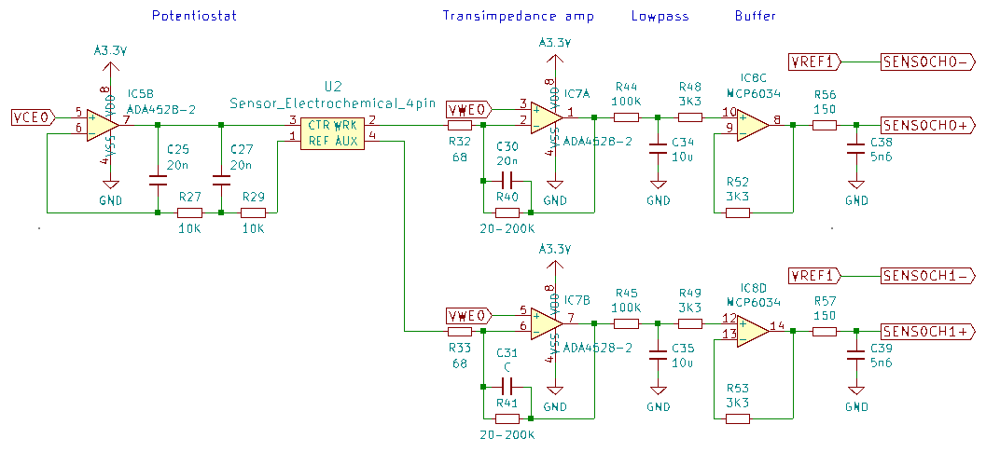
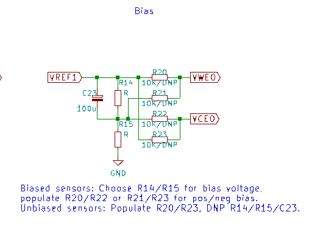
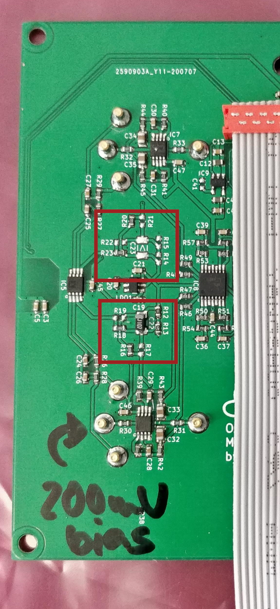
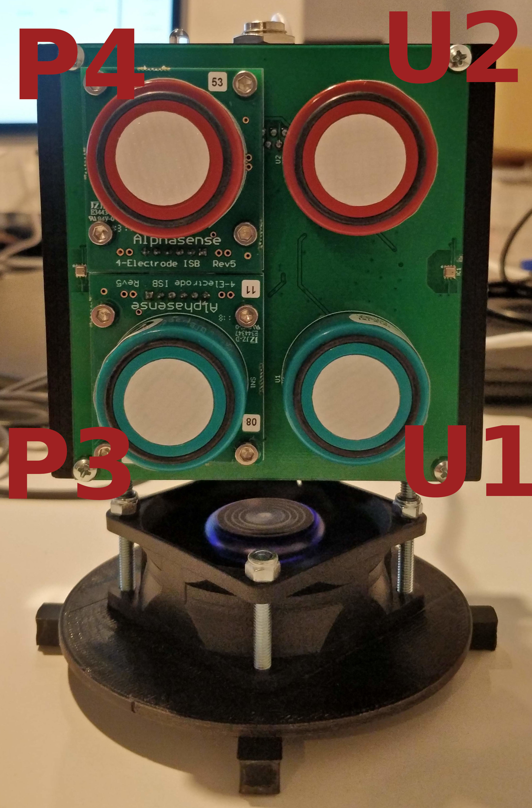

# quadsense-twin

This repository contains schematics and board files for an OpenAir
module intended to evaluate the viability of an alternative circuitry to
Alphasense provided ISB (individual support board) for gas sensors.

The board design is based on the original quadsense, with two ISB
mounted sensors replaced by sensors mounted directly on the board. The
support circuitry provided by the ISB boards is integrated directly on
the board.

# Circuitry

Each sensor has four electrodes. The circuit to the left of the sensor
maintains a constant voltage at the counter and reference electrodes.
The circuitry to the right of the electrodes amplifies and filters the
current flowing from the working and auxiliary electrodes.

The concentration being measured is proportional to the difference of
the working electrode exposed to the gas and the unexposed auxiliary
electrode.

The voltage maintained at the referenced and counter electrodes may be offset
by a bias voltage. 

Whether a positive or negative bias voltage is applied voltage
determined by jumper configuration (U1: R16/R17 & R18/R19, U2: R20/R21 &
R22/R23). The value of the bias is determined by a voltage divider (U1:
R12/R13, U2:R14/R15). 

The photograph below highlights an unbiased (U2, top rectangle) and 200mV biased
configuration (U1, bottom rectangle, R12=15k R13=12k). 

# Test boards

| MAC | Sensor U1 | Sensor U2 | ISB 1 | ISB 2 |
|-|-|-|-|-|
| 30:AE:A4:0A:AA:98 | [C0-B4](http://www.alphasense.com/WEB1213/wp-content/uploads/2019/09/CO-B4.pdf) | [OX-B431](http://www.alphasense.com/WEB1213/wp-content/uploads/2019/09/OX-B431.pdf) | CO-B4 | OX-B431 |
| 30:AE:A4:0A:A9:D8 | [NO-B4](http://www.alphasense.com/WEB1213/wp-content/uploads/2019/09/NO-B4.pdf) (biased) | [NO2-B43F](http://www.alphasense.com/WEB1213/wp-content/uploads/2019/09/NO2-B43F.pdf) | NO-B4 | NO2-B43F |

# Sensor Configuration

The following picture and table describe the sensor configuration:

| Name Schematic | ADC Channel | Tag Firehose | Name Firehose | Sensor AA:98 | Sensor A9:D8 |
| -- | - | - | - | - | - |
| U1 | 2 | 0x03 | OA_Alpha_3 | CO-B4 working electrode   | NO-B4 working |
| U1 | 3 | 0x04 | OA_Alpha_4 | CO-B4 auxiliary electrode | NO-B4 AUX |
| U2 | 0 | 0x01 | OA_Alpha_1 | OX-B431 working           | NO2-B43F working |
| U2 | 1 | 0x02 | OA_Alpha_2 | OX-B431 AUX               | NO2-B43F AUX |
| P3 | 4 | 0x05 | OA_Alpha_5 | CO-B4 (ISB) working       | NO-B4 (ISB) working |
| P3 | 5 | 0x06 | OA_Alpha_6 | CO-B4 (ISB) AUX           | NO-B4 (ISB) AUX |
| P4 | 6 | 0x07 | OA_Alpha_7 | OX-B431 (ISB) working     | NO2-B43F (ISB) working |
| P4 | 7 | 0x08 | OA_Alpha_8 | OX-B431 (ISB) AUX         | NO2-B43F (ISB) AUX |

